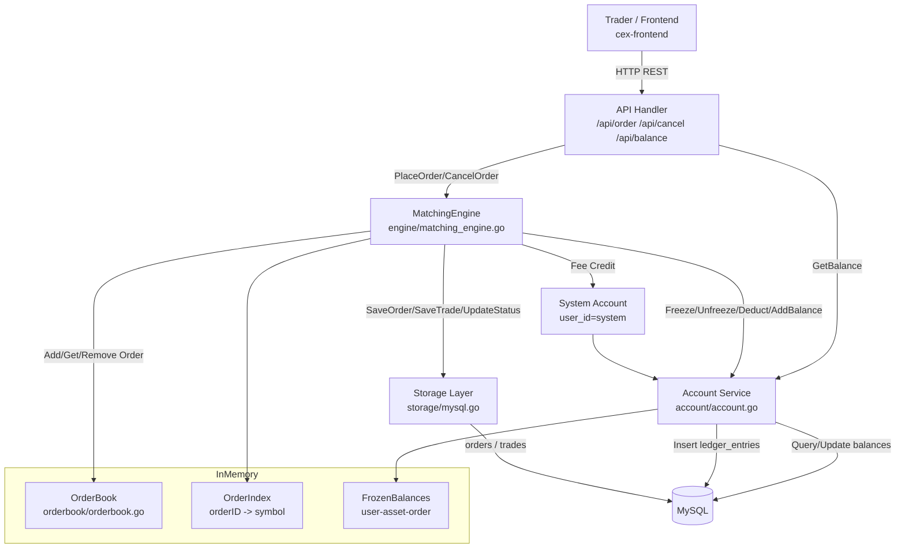

```mermaid
flowchart TD
    U[Trader / Frontend<br/>cex-frontend] -->|HTTP REST| A[API Handler<br/>/api/order /api/cancel /api/balance]

    A -->|PlaceOrder/CancelOrder| E[MatchingEngine<br/>engine/matching_engine.go]
    A -->|GetBalance| AC[Account Service<br/>account/account.go]

    E -->|Add/Get/Remove Order| OB[OrderBook<br/>orderbook/orderbook.go]
    E -->|Freeze/Unfreeze/Deduct/AddBalance| AC
    E -->|SaveOrder/SaveTrade/UpdateStatus| S[Storage Layer<br/>storage/mysql.go]

    AC -->|Query/Update balances| DB[(MySQL)]
    AC -->|Insert ledger_entries| DB
    S -->|orders / trades| DB

    E -->|Fee Credit| SYS[System Account<br/>user_id=system]
    SYS --> AC

    subgraph InMemory
        OB
        IDX[OrderIndex<br/>orderID -> symbol]
        FB[FrozenBalances<br/>user-asset-order]
    end

    E --> IDX
    AC --> FB
```